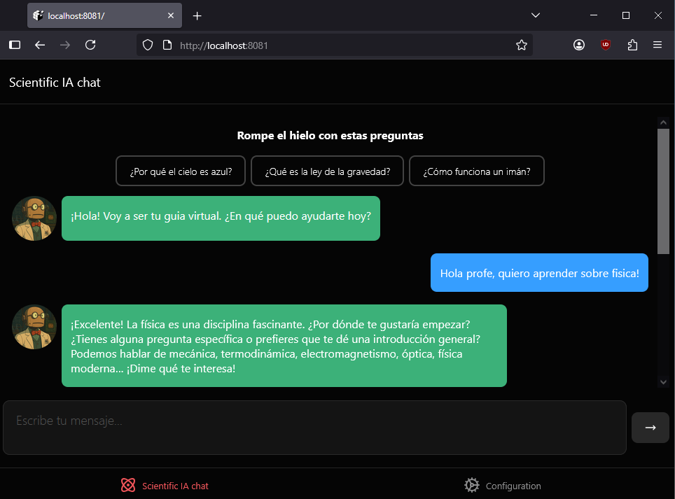

# Chatbot de Ciencia - Profesor Virtual

Este proyecto es un chatbot interactivo diseñado para responder preguntas de ciencia. El bot actúa como un profesor virtual, listo para ayudarte a resolver dudas y aprender sobre temas científicos de manera sencilla y amigable.

## Características principales
- Chat en tiempo real con un asistente de IA especializado en ciencia.
- Interfaz moderna y responsiva, tanto para web como para dispositivos móviles.
- Sugerencias de preguntas para romper el hielo.
- Indicador de escritura y manejo de errores.

## Tecnologías y librerías utilizadas
- **Expo**: Framework para desarrollo multiplataforma (web, Android, iOS).
- **React Native** y **React**: Base del frontend y lógica de componentes.
- **Tamagui**: Sistema de UI para estilos y componentes visuales consistentes.
- **React Native Reanimated**: Animaciones fluidas y nativas.
- **Google Vertex AI**: Motor de inteligencia artificial para generar respuestas precisas y contextuales.
- **@ai-sdk/react**: Integración sencilla con proveedores de IA.
- **React Navigation**: Navegación entre pantallas.

## ¿Cómo levantar el proyecto?

### Requisitos previos
- Tener instalado [Node.js](https://nodejs.org/) y [Yarn](https://yarnpkg.com/)
- Tener instalado [Expo CLI](https://docs.expo.dev/get-started/installation/):
  ```sh
  npm install -g expo-cli
  ```

### Instalación
1. Clona el repositorio y entra a la carpeta del proyecto.
2. Instala las dependencias:
   ```sh
   yarn install
   ```

### Levantar en modo web
```sh
yarn web
```
Esto abrirá el proyecto en tu navegador predeterminado.



### Levantar en modo app (Android/iOS)
1. Asegúrate de tener un emulador o dispositivo físico conectado.
2. Ejecuta:
   ```sh
   yarn android
   # o para iOS
   yarn ios
   ```

#### ¡Habla con el guia, para aprender!
<video controls src="https://github.com/user-attachments/assets/d4f3ab97-3743-4403-946d-f23793ed9b86" title="¡Habla con el guia, para aprender!" width="" height=""></video>

#### Modifica el tema
<video controls src="https://github.com/user-attachments/assets/ecea9799-1ed4-4fc4-96a2-9fb289676a66" title="Modifica el tema" width="" height=""></video>

### Levantar en modo desarrollo (Expo Go)

```sh
npx expo start -c
```
Escanea el QR con la app Expo Go en tu dispositivo móvil.

## Estructura principal del proyecto
- `app/` - Pantallas y rutas principales.
- `components/` - Componentes reutilizables de UI.
- `constants/` - Utilidades y constantes globales.
- `context/` - Contextos de React para manejo de estado global.
- `assets/` - Imágenes y fuentes.

## Créditos
Desarrollado con ❤️ usando Expo, Tamagui, React y Google Vertex AI.
